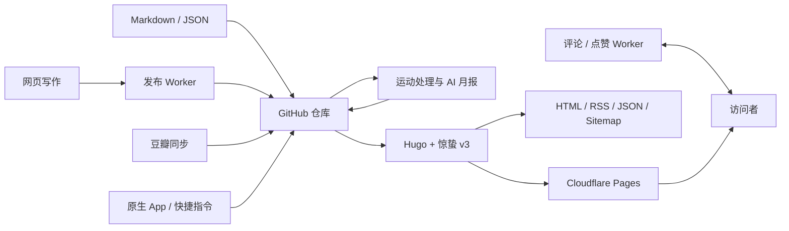

# 惊蛰 Jingzhe

惊蛰是一套基于 Hugo、GitHub Actions 与可选 Serverless 服务构建的个人数字生活发布系统。它不仅用于发布长篇文章，还把短动态、网页写作、评论互动、观影同步、隐私友好的运动可视化与 AI 月度复盘组织在同一个 Git 仓库中。

本仓库同时是 [Koobai](https://koobai.com) 的真实生产站点、惊蛰的完整演示和可复用开源实现。Core 初始化工具可生成不包含 Koobai 真实内容与生产服务的最小站点；Publisher、Social、Life Data 和 AI Coach 可以按需启用。

## 项目特点

- 长篇随笔与短动态按时间统一展示。
- 完整自研的惊蛰 v3 Hugo 主题。
- 浅色、深色与跟随系统三种外观模式。
- 自定义全文 RSS、Section JSON、Sitemap 与 Web App Manifest。
- 浏览器内写随笔、写唠叨、Markdown 预览、图片压缩上传与 GitHub 写回。
- 评论、多层回复、点赞、表情与 Cloudflare Turnstile。
- 豆瓣观影记录增量同步与电影票式展示。
- 多种运动类型、Mapbox 轨迹、月历、心率区间、成就与运动海报。
- 隐私运动使用公共地标路线表达，避免公开原始轨迹。
- AI 月中/月末运动复盘，包含证据约束、隐私过滤与状态冻结。
- GitHub Actions 自动测试、数据处理、构建和 Cloudflare Pages 部署。

完整功能边界见[功能与安装层级](docs/features/overview.md)。

> **想快速部署？直接交给 AI：** 把本仓库地址和[可复制的部署指令](docs/ai/quick-start.md#可直接复制给-ai-的指令)发给支持读取 GitHub 仓库的 AI。它会先确认站点信息、功能层级和部署平台，从安全的 Core 开始，本地验证通过后再询问是否操作 GitHub 或 Cloudflare。

## 功能层级

惊蛰提供五种逐步增强的使用层级。未配置的可选模块不会阻止核心博客运行。

| 层级 | 能力 | 额外依赖 |
|---|---|---|
| Core | 文章、唠叨、主题、标签、RSS、JSON | Hugo Extended |
| Publisher | 网页写作、图片上传、GitHub 写回、草稿 | 管理端 Worker、GitHub 凭据、图片存储 |
| Social | 评论、回复、点赞、Turnstile | Comments/Likes Worker 与 D1 |
| Life Data | 豆瓣同步、运动统计、地图与隐私路线 | Python、Mapbox、数据来源 |
| AI Coach | 月中/月末 AI 运动复盘 | 模型 API 与隐私配置 |

当前生产站点使用 Full Profile，并由 [koobai.com](https://koobai.com) 作为唯一在线演示。Core Profile 不依赖 Worker，由初始化工具在新目录按需生成，不维护第二套演示站。

## 当前架构



详细说明见[架构总览](docs/architecture/overview.md)。

## 本地查看参考站点

### 前置条件

- Git
- Hugo Extended 0.120.0 或更高版本
- Python 3.9 或更高版本仅用于运动处理和相关测试

### 运行

```bash
git clone https://github.com/koobai/blog.git
cd blog
hugo server
```

访问 Hugo 输出的本地地址即可查看站点。

当前仓库仍是 Koobai 的生产参考实现，因此部分图片、地图、评论、点赞和网页写作能力依赖 Koobai 的公开资源或私有服务。请勿把生产管理页面或生产接口当成通用安装方式。功能开关已经可用，通用 Worker 部署包位于 `workers/`，默认不会自动部署或切换 Koobai 的生产服务。

默认命令仍使用 Koobai Production 配置；原有本地预览和 Cloudflare 构建方式没有改变。

## 生成最小 Core 站点

AI 或用户可在仓库外的新目录生成不读取 Koobai 内容、真实数据和 Worker 的最小站点：

```bash
python3 tools/jingzhe.py init --output ../my-jingzhe --title "我的站点"
```

该目录仅在调用命令时生成，不是需要同步部署的第二个演示站。配置环境、功能开关和公开参数见[配置说明](docs/configuration.md)。

构建输出目录、上线前检查和可选服务接入见[部署说明](docs/deployment.md)。

## 验证当前源码

生产构建：

```bash
hugo --minify --panicOnWarning
```

Python 测试：

```bash
PYTHONDONTWRITEBYTECODE=1 python3 -m unittest discover -s tests -p 'test_*.py'
```

JavaScript 语法检查：

```bash
node --check static/js/comments.js
node --check static/js/exercise-map.js
node --check static/js/exercise-ui.js
node --check static/js/laodao.js
node --check static/js/movies.js
```

Worker 行为测试：

```bash
node tests/test_workers.mjs
```

统一检查：

```bash
python3 tools/jingzhe.py doctor
python3 tools/jingzhe.py validate
python3 tools/jingzhe.py check
```

命令、JSON 输出、Core 初始化和 Starter 打包说明见 [AI 工具链](docs/tooling.md)。

## 内容结构

```text
content/
├── posts/                 # 长篇随笔
├── laodao/YYYY/MM/        # 短动态
└── pages/                 # 关于、观影、运动和管理页面

assets/
├── movie.json             # 观影数据
├── activities.json        # 运动数据
├── landmark_route_library.json
└── monthly_insights.json  # 月度统计与 AI 报告

themes/jingzhe_v3/         # 当前生产主题
static/js/                 # 页面交互脚本
workers/                   # 四个独立 Worker、Wrangler 示例、D1 迁移与 OpenAPI
config/                    # 通用、生产与开发配置
schemas/                   # Front Matter、参数和 JSON Schema
data/jingzhe/features.json # 机器可读功能注册表
jingzhe/                   # Python 共享契约加载器
.github/workflows/         # 同步、处理和部署工作流
```

## 生产兼容原则

开源整理不会要求 Koobai 改变现有发布习惯。下列行为属于兼容基线：

- `/newlaodao` 和 `/newsuibi` 的使用方式保持不变。
- `content/posts/`、`content/laodao/YYYY/MM/` 等内容路径保持不变。
- 已有 Front Matter、永久链接、评论 URL 与点赞 URL 保持兼容。
- 浏览器草稿、登录、主题和点赞所使用的 LocalStorage Key 保持兼容。
- Worker 路由、Header 和请求字段在完成兼容测试前不改变。
- GitHub Actions 依赖的提交信息和 Secrets 名称不擅自改变。
- 豆瓣、原生 App、运动处理、AI 月报和 Cloudflare Pages 流程继续运行。

完整约束见[生产兼容基线](docs/architecture/compatibility.md)。

## AI 协作

AI 编程助手在修改仓库前必须先阅读 [AGENTS.md](AGENTS.md)。该文件定义了：

- 源文件与生成文件边界。
- 不可破坏的生产兼容契约。
- Secrets 和隐私规则。
- 不同类型改动必须运行的检查。
- Worker 的最小权限、Secret、隐私和生产迁移边界。

第一次使用建议从 [AI 快速开始](docs/ai/quick-start.md) 进入；维护和二次开发规则见 [AI 安装与维护协议](docs/ai/setup-protocol.md)。

## 文档

- [文档入口](docs/README.md)
- [AI 快速开始](docs/ai/quick-start.md)
- [架构总览](docs/architecture/overview.md)
- [前端与数据模块契约](docs/architecture/modules.md)
- [生产兼容基线](docs/architecture/compatibility.md)
- [功能与安装层级](docs/features/overview.md)
- [隐私与外部数据边界](docs/privacy/overview.md)
- [AI 安装与维护协议](docs/ai/setup-protocol.md)
- [AI 工具链](docs/tooling.md)
- [配置、Profile 与 Core 初始化](docs/configuration.md)
- [部署说明](docs/deployment.md)
- [Worker 安全与部署边界](docs/security/workers.md)
- [Worker 部署入口](workers/README.md)

## 授权

程序代码、惊蛰主题、工具、Worker、技术文档和 Core 合成示例采用 [MIT License](LICENSE)。Koobai 的真实文章、个人数据和图片保留所有权利，详见[内容授权边界](CONTENT_LICENSE.md)；Koobai 名称、头像与 Logo 不包含在 MIT 授权中，详见[品牌说明](BRAND.md)。第三方浏览器脚本的版本、哈希与许可证副本见 [Third-party Notices](THIRD_PARTY_NOTICES.md)。
