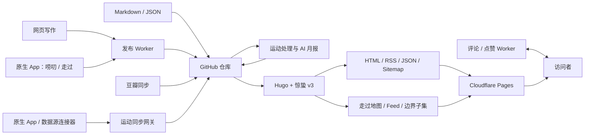

# 惊蛰 Jingzhe

[简体中文](README.md) | [English](README_EN.md)

> **长文写随笔，短话发唠叨；记折腾、看影视、动起来，也把真正走过的地方留在地图上。**

惊蛰是一套用来记录工作、生活与各种折腾的开源个人博客系统。你可以随手发几句日常唠叨，认真写一篇随笔，留下技术折腾与备忘；也可以整理看过的电影和剧集、记录运动与变化，把去过的地方聚合成“走过”地图，再让 AI 帮你完成月度复盘。

它基于 Hugo、GitHub Actions 与可选 Serverless 服务构建，文章和生活数据统一保存在自己的 Git 仓库中。你可以从一个干净的静态博客开始，也可以按需增加网页写作、评论点赞、影视同步、运动可视化和 AI 总结。

本仓库同时是 [Koobai](https://koobai.com) 的真实生产站点、惊蛰的完整演示和可复用开源实现。Core 初始化工具可生成不包含 Koobai 真实内容与生产服务的最小站点；Publisher、Social、Life Data 和 AI Coach 可以按需启用。

## 项目特点

- **生活时间线**：随笔、唠叨和折腾备忘统一展示，并通过标签与分类组织内容。
- **自研 Hugo 主题**：响应式设计，支持浅色、深色、跟随系统和图片灯箱。
- **轻量写作后台**：解决静态博客不能在线发文的痛点，打开浏览器即可写随笔、发唠叨、预览 Markdown、保存草稿、上传图片并发布到 GitHub。
- **内容自己掌控**：文章与公开生活数据保存在自己的 Git 仓库，并生成全文 RSS、JSON、Sitemap、Web App Manifest 和完整分享元数据。
- **评论与互动**：支持评论、多层回复、点赞、表情和管理，并通过 Cloudflare Turnstile 降低滥用。
- **观影记录**：增量同步豆瓣数据，以电影票形式展示评分、短评和观看时间。
- **运动与隐私**：提供运动统计、月历、心率、Mapbox 轨迹、成就和海报，并用公共地标路线保护隐私运动。
- **走过地图日志**：把独立记录、唠叨和随笔中的地点聚合成地图与移动端列表；Markdown 是正式内容来源，边界和页面 JSON 在 Hugo 构建期自动生成。
- **AI 运动复盘**：生成月中与月末总结，只向模型发送经过过滤的聚合数据。
- **按需组合功能**：Core 静态博客无需 Worker，写作、互动、生活数据和 AI 能力均可独立启用。
- **AI 与自动化友好**：支持直接交给 AI 初始化和部署，并通过 GitHub Actions 完成测试、同步、处理、构建与发布。

完整功能边界见[功能与安装层级](docs/features.md)。

> **想快速部署？直接交给 AI：** 把本仓库地址和[可复制的部署指令](docs/quick-start.md#可直接复制给-ai-的指令)发给支持读取 GitHub 仓库的 AI。它会先确认站点信息、功能层级和部署平台，从安全的 Core 开始，本地验证通过后再询问是否操作 GitHub 或 Cloudflare。

如果还需要自动同步运动数据，可以直接补充一句：`帮我部署惊蛰博客和运动同步网关（Activity Sync Worker），并把我的 Keep/Health Connect 数据转换成 exercise-sync-v1 协议进行同步。`

## 功能层级

惊蛰提供五种逐步增强的使用层级。未配置的可选模块不会阻止核心博客运行。

| 层级 | 能力 | 额外依赖 |
|---|---|---|
| Core | 文章、唠叨、主题、标签、RSS、JSON | Hugo Extended |
| Publisher | 网页写作、图片上传、GitHub 写回、草稿 | 管理端 Worker、GitHub 凭据、图片存储 |
| Social | 评论、回复、点赞、Turnstile | Comments/Likes Worker 与 D1 |
| Life Data | 豆瓣同步、运动统计、走过地图与隐私路线 | 按子模块选择 Python、Mapbox 和自己的数据；自动运动同步可选运动同步网关（Activity Sync Worker） |
| AI Coach | 月中/月末 AI 运动复盘 | 模型 API 与隐私配置 |

当前生产站点使用 Full Profile，并由 [koobai.com](https://koobai.com) 作为唯一在线演示。Core Profile 不依赖 Worker，由初始化工具在新目录按需生成，不维护第二套演示站。

## 当前架构



详细说明见[架构与模块契约](docs/architecture.md)。

## 本地查看参考站点

### 前置条件

- Git
- Hugo Extended 0.158.0 或更高版本
- Python 3.9 或更高版本仅用于运动处理和相关测试

### 运行

```bash
git clone https://github.com/koobai/blog.git
cd blog
hugo server
```

访问 Hugo 输出的本地地址即可查看站点。

当前仓库仍是 Koobai 的生产参考实现，因此部分图片、地图、评论、点赞和网页写作能力依赖 Koobai 的公开资源或私有服务。请勿把生产管理页面或生产接口当成通用安装方式。功能开关已经可用，通用 Worker 部署包位于 `workers/`，默认不会自动部署或切换 Koobai 的生产服务。

默认命令仍使用 Koobai Production 配置；原有本地预览和 Cloudflare 构建方式没有改变。

## 生成最小 Core 站点

AI 或用户可在仓库外的新目录生成不读取 Koobai 内容、真实数据和 Worker 的最小站点：

```bash
python3 tools/jingzhe.py init --output ../my-jingzhe --title "我的站点"
```

该目录仅在调用命令时生成，不是需要同步部署的第二个演示站。配置环境、功能开关和公开参数见[配置说明](docs/configuration.md)。

构建输出目录、上线前检查和可选服务接入见[部署说明](docs/deployment.md)。

## 验证当前源码

生产构建：

```bash
hugo --minify --panicOnWarning
```

Python 测试：

```bash
PYTHONDONTWRITEBYTECODE=1 python3 -m unittest discover -s tests -p 'test_*.py'
```

JavaScript 语法检查：

```bash
find themes/jingzhe_v3/assets/js -name '*.js' -print0 | xargs -0 -n 1 node --check
node tests/test_nav_motion.js
node tests/test_exercise_modules.js
node tests/test_zouguo_model.js
```

Worker 行为测试：

```bash
node tests/test_workers.mjs
```

统一检查：

```bash
python3 tools/jingzhe.py doctor
python3 tools/jingzhe.py validate
python3 tools/jingzhe.py check
```

命令、JSON 输出、Core 初始化和 Starter 打包说明见 [AI 工具链](docs/tooling.md)。

## 内容结构

```text
content/
├── posts/                 # 长篇随笔
├── laodao/YYYY/MM/        # 短动态
├── zouguo/                # 独立走过；也可聚合带“走过”Tag 的唠叨和随笔
└── pages/                 # 关于、观影、运动和管理页面

assets/
└── data/                  # Hugo 公开读取的数据资产
    ├── movies.json        # 观影数据
    └── exercise/
        ├── activities.json       # 处理后的运动展示数据
        ├── landmark-routes.json  # 公共地标路线契约
        └── monthly-insights.json # 月度统计与 AI 报告

data/exercise/
└── activities.json        # 来源无关的原始运动事实

themes/jingzhe_v3/
├── layouts/pages/         # content/pages 的专用布局
├── layouts/zouguo.html    # 走过内容类型入口
└── assets/
    ├── css/               # style.css 总入口；运动/走过按职责分片
    └── js/
        ├── navigation/    # 桌面、移动与滚动导航
        ├── exercise/      # 运动模型、地图、UI、海报与控制器
        ├── zouguo/        # 走过数据模型与地图控制器
        └── pages/         # 普通页面专属脚本
static/js/                 # 按许可证原样保留的第三方浏览器脚本
workers/                   # 五个独立 Worker、Wrangler 示例、D1 迁移与 OpenAPI
config/                    # 通用、生产与开发配置
schemas/                   # Front Matter、参数和 JSON Schema
data/jingzhe/features.json # 机器可读功能注册表
jingzhe/                   # 运动处理、月报与共享契约模块
.github/workflows/         # 测试、同步、处理、构建和部署工作流
```

维护时按“事实来源”定位，不按文件名猜测：

| 要修改什么 | 首选位置 | 同步检查 |
| --- | --- | --- |
| 文章、唠叨、走过记录 | `content/` | Front Matter、永久链接、走过聚合 |
| 关于/观影/运动页面结构 | `layouts/pages/` | 对应 `content/pages/` 的 `layout` |
| 全站/功能样式 | `assets/css/style.css` 与功能目录 | 导入顺序、深浅模式、响应式页面 |
| 浏览器交互 | `assets/js/navigation/`、`exercise/`、`zouguo/`、`pages/` | Hugo bundle 顺序与 Node 契约测试 |
| 浏览器会读取的生活数据 | `assets/data/` | `features.json` 数据目录、Schema、生成脚本和 Actions |
| 不应直接发布的运动原始事实 | `data/exercise/activities.json` | 只能由同步网关写入、处理器读取 |
| 自动化和外部服务 | `.github/workflows/`、`workers/` | Secret、最小权限、提交路径与部署触发链 |

`public/`、`resources/` 和 Hugo 锁文件均为可再生输出，不是维护入口，也不得提交。Hugo 已启用目标目录自动清洁；每次改动以 `python3 tools/jingzhe.py check` 作为统一门禁。

## 生产兼容原则

开源整理不会要求 Koobai 改变现有发布习惯。下列行为属于兼容基线：

- `/newlaodao` 和 `/newsuibi` 的使用方式保持不变。
- `content/posts/`、`content/laodao/YYYY/MM/`、`content/zouguo/` 等内容路径保持不变。
- `/zouguo/`、三类来源身份和自动生成的走过 feed/边界子集保持兼容；不要手工维护生成 JSON。
- 已有 Front Matter、永久链接、评论 URL 与点赞 URL 保持兼容。
- 浏览器草稿、登录、主题和点赞所使用的 LocalStorage Key 保持兼容。
- Worker 路由、Header 和请求字段在完成兼容测试前不改变。
- GitHub Actions 依赖的提交信息和 Secrets 名称不擅自改变。
- 豆瓣、原生 App、运动处理、AI 月报和 Cloudflare Pages 流程继续运行。

完整约束见[生产兼容基线](docs/compatibility.md)。

## AI 协作

AI 编程助手在修改仓库前必须先阅读 [AGENTS.md](AGENTS.md)。该文件定义了：

- 源文件与生成文件边界。
- 不可破坏的生产兼容契约。
- Secrets 和隐私规则。
- 不同类型改动必须运行的检查。
- Worker 的最小权限、Secret、隐私和生产迁移边界。

第一次使用建议从 [AI 快速开始](docs/quick-start.md) 进入；维护和二次开发规则见 [AI 安装与维护协议](docs/ai-protocol.md)。

## 文档

- [文档入口](docs/README.md)
- [AI 快速开始](docs/quick-start.md)
- [架构与模块契约](docs/architecture.md)
- [生产兼容基线](docs/compatibility.md)
- [功能与安装层级](docs/features.md)
- [隐私与外部数据边界](docs/privacy.md)
- [AI 安装与维护协议](docs/ai-protocol.md)
- [AI 工具链](docs/tooling.md)
- [配置、Profile 与 Core 初始化](docs/configuration.md)
- [部署说明](docs/deployment.md)
- [“走过”地图日志](docs/zouguo.md)
- [Worker 部署与安全边界](workers/README.md)

## 授权

程序代码、惊蛰主题、工具、Worker、技术文档和 Core 合成示例采用 [MIT License](LICENSE)。Koobai 的真实文章、个人数据和图片保留所有权利，详见[内容授权边界](CONTENT_LICENSE.md)；Koobai 名称、头像与 Logo 不包含在 MIT 授权中，详见[品牌说明](BRAND.md)。第三方浏览器脚本的版本、哈希与许可证副本见 [Third-party Notices](THIRD_PARTY_NOTICES.md)。
