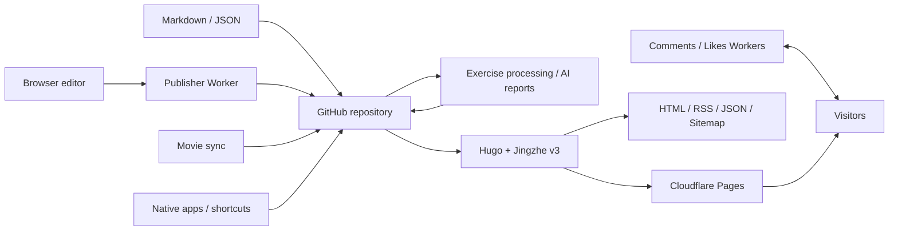

# Jingzhe

[简体中文](README.md) | English

> **Write long-form essays and post short thoughts; document experiments, track what you watch, and keep moving—capture the everyday and every change along the way.**

Jingzhe is an open-source personal blogging system for documenting work, everyday life, and everything you enjoy tinkering with. Use it for quick updates, thoughtful essays, technical notes, and lessons learned; keep track of films and series, follow every step of your fitness journey, and let AI help turn each month of activity into a meaningful review.

It is built with Hugo, GitHub Actions, and optional serverless services, keeping both writing and public life data in your own Git repository. Start with a clean static blog, then add browser-based publishing, comments and likes, movie synchronization, exercise visualizations, and AI summaries only when you need them.

This repository is both the production source of [Koobai](https://koobai.com), the complete live demo of Jingzhe, and a reusable open-source implementation. The Core initializer creates a clean site without Koobai's personal content or production services. Publisher, Social, Life Data, and AI Coach features can then be enabled independently.

## Highlights

- **Life timeline:** present essays, short updates, and technical notes together, organized with tags and categories.
- **Custom Hugo theme:** responsive design with light, dark, and system modes, plus an image lightbox.
- **Lightweight writing dashboard:** solve the static-blog publishing gap by writing essays and updates, previewing Markdown, saving drafts, uploading images, and publishing to GitHub from a browser.
- **Content under your control:** keep writing and public life data in your own Git repository, with full-text RSS, JSON, sitemap, and Web App Manifest outputs.
- **Social interactions:** add comments, nested replies, likes, emoji, moderation, and Cloudflare Turnstile protection.
- **Movie log:** synchronize Douban records incrementally and present ratings, notes, and viewing dates as ticket-style cards.
- **Exercise with privacy:** combine statistics, calendars, heart rate, Mapbox tracks, achievements, and posters with landmark-based substitutes for private routes.
- **AI exercise reviews:** generate mid-month and end-of-month summaries from filtered aggregate evidence only.
- **Modular by design:** Core needs no Worker; publishing, social, life data, and AI capabilities can be enabled independently.
- **AI and automation friendly:** let an AI agent initialize and deploy the project, while GitHub Actions handles testing, synchronization, processing, builds, and deployment.

See [Features and installation profiles](docs/features.md) for the complete capability boundaries.

> **Want the fastest setup? Give it to an AI coding agent.** Send the repository URL together with the [copy-ready setup prompt](docs/quick-start.md#copy-ready-ai-prompt) to an agent that can read GitHub repositories. It will confirm your site identity, feature profile, and hosting platform, start with the safe Core profile, verify everything locally, and ask before changing GitHub or Cloudflare resources.

The detailed documentation is currently maintained in Chinese. Modern coding agents can read it directly and communicate with you in English.

## Feature Profiles

Optional modules enhance the site progressively. A missing optional service never prevents the Core blog from building.

| Profile | Capabilities | Additional dependencies |
|---|---|---|
| Core | Posts, short updates, theme, tags, RSS, and JSON | Hugo Extended |
| Publisher | Browser writing, image upload, GitHub publishing, and drafts | Publisher/Drafts Workers, GitHub credentials, and image storage |
| Social | Comments, replies, likes, and Turnstile | Comments/Likes Workers and D1 |
| Life Data | Movie sync, exercise statistics, maps, and privacy routes | Python, Mapbox, and personal data sources |
| AI Coach | Mid-month and end-of-month exercise reviews | Model API and privacy configuration |

The production site uses the Full Profile, with [koobai.com](https://koobai.com) as the only live demo. Core does not require any Worker and is generated into a new directory; the repository does not maintain a second demo site.

## Architecture



See [Architecture and module contracts](docs/architecture.md) for data flows, module boundaries, and compatibility constraints.

## Preview the Production Reference

Requirements:

- Git
- Hugo Extended 0.120.0 or later
- Python 3.9 or later only for exercise processing and related tests

```bash
git clone https://github.com/koobai/blog.git
cd blog
hugo server
```

Open the local address printed by Hugo. The default command continues to use the Koobai production reference configuration. Some images, maps, social features, and browser-based publishing functions depend on Koobai's public assets or private services and are not generic installation defaults.

## Generate a Minimal Core Site

Create a new site outside this repository without reading or copying Koobai's content, personal data, or Workers:

```bash
python3 tools/jingzhe.py init --output ../my-jingzhe --title "My Site"
```

The generated site contains the reusable Core theme, generic configuration, and clearly marked synthetic examples. It has no required external service. See [Configuration](docs/configuration.md) and [Deployment](docs/deployment.md) before publishing it.

## Verify the Source

Run all local contracts, tests, link checks, privacy checks, and strict Production/Core builds:

```bash
python3 tools/jingzhe.py check
```

Useful focused commands:

```bash
python3 tools/jingzhe.py doctor
python3 tools/jingzhe.py validate
node tests/test_workers.mjs
hugo --minify --panicOnWarning
```

See [AI tooling](docs/tooling.md) for JSON output, initialization, and Starter packaging commands.

## Repository Map

```text
content/                    Long-form posts, short updates, and pages
assets/                     Production movie, exercise, route, and report data
themes/jingzhe_v3/          Production Hugo theme
config/                     Shared, production, and development configuration
data/jingzhe/               Machine-readable feature and exercise contracts
schemas/                    Front Matter, configuration, and JSON schemas
tools/                      Initialization, diagnostics, and validation CLI
workers/                    Four independently deployable Cloudflare Workers
.github/workflows/          Sync, processing, testing, and deployment workflows
```

## Production Compatibility

The open-source structure does not require Koobai to change its existing writing or publishing workflow. Content paths, Front Matter, permanent URLs, browser storage keys, Worker routes, GitHub Actions secrets, movie synchronization, exercise processing, AI reports, and Cloudflare Pages deployment remain protected compatibility contracts.

Read [Production compatibility](docs/compatibility.md) before modifying an existing Koobai installation. AI coding agents must also read [AGENTS.md](AGENTS.md) before changing this repository.

## Documentation

- [Documentation index](docs/README.md)
- [AI quick start](docs/quick-start.md)
- [Features and installation profiles](docs/features.md)
- [Configuration and Core initialization](docs/configuration.md)
- [Deployment](docs/deployment.md)
- [Architecture and module contracts](docs/architecture.md)
- [Production compatibility](docs/compatibility.md)
- [Privacy and external-data boundaries](docs/privacy.md)
- [AI installation and maintenance protocol](docs/ai-protocol.md)
- [Worker deployment and security boundaries](workers/README.md)

## Licensing

Source code, the Jingzhe theme, tools, Workers, technical documentation, and synthetic Core examples are licensed under the [MIT License](LICENSE).

Koobai's real posts, personal data, and images are not included in the MIT grant; see the [Content License](CONTENT_LICENSE.md). The Koobai name, avatar, and logo are excluded as described in the [Brand Guidelines](BRAND.md). Third-party browser scripts, hashes, and license copies are recorded in [Third-party Notices](THIRD_PARTY_NOTICES.md).
