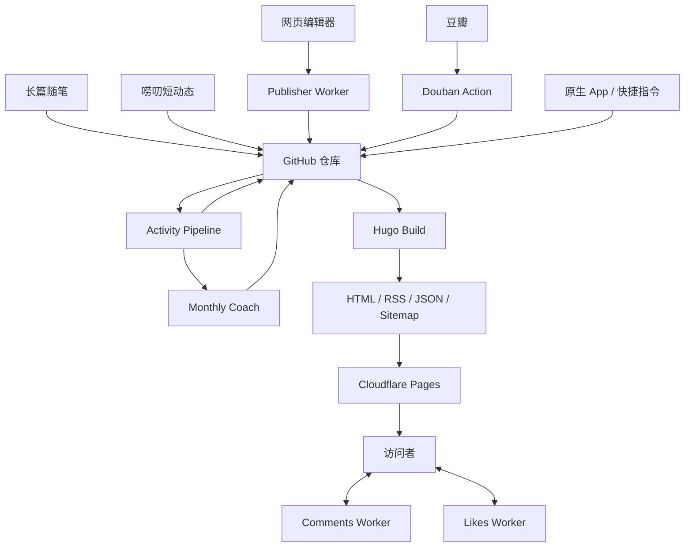

# 架构总览

## 系统定位

惊蛰以 Git 仓库作为内容与公开数据的主要事实来源，以 Hugo 生成静态站点，并通过 GitHub Actions 和可选 Serverless 服务补足同步、写作与互动能力。

Hugo 是发布核心，但完整系统还包括内容采集、数据加工、动态服务和部署四个边界。

## 主要组件

| 组件 | 当前职责 | 事实来源 |
|---|---|---|
| Hugo | 页面、SEO/分享元数据、RSS、JSON、Sitemap 和静态资源生成 | `config/`、`content/`、`themes/`、`static/` |
| 惊蛰 v3 | 布局、响应式设计、深浅主题和功能页面 | `themes/jingzhe_v3/` |
| 网页编辑器 | 写随笔、写唠叨、图片上传、草稿和 GitHub 写回 | 写作模板与 `assets/js/pages/editor-*.js` |
| 观影同步 | 从豆瓣合并新增/更新记录并原子写入 `movie.json` | `sync_movies.py`、`douban.yml` |
| 运动管线 | 数据清洗、隐私路线、趣味标题和月报触发 | `process_activities.py` → `jingzhe/activity_processing.py`、`public_routes.py` |
| AI 月报 | 聚合证据、模型调用、校验和状态冻结 | `monthly_coach.py` → `jingzhe/monthly_stats.py`、`monthly_reports.py` |
| 动态服务 | 评论、点赞、发布、图片和云草稿 | `workers/` 中四个独立 Cloudflare Worker |
| GitHub Actions | 同步、测试、处理、构建和部署 | `.github/workflows/` |

## 数据流

## Worker-independent 能力与动态增强

### 不依赖 Worker 的能力

以下能力应在没有任何 Worker 的情况下可用：

- 文章与唠叨展示。
- 标签和分类。
- 深浅主题。
- RSS、JSON 和 Sitemap。
- Full Profile 中的观影 JSON 静态展示。
- Full Profile 中的已处理运动 JSON 静态展示。

最小 Core Starter 只包含文章、唠叨、主题、标签和标准静态输出，不复制 Koobai 的观影或运动数据。

### 动态增强

以下能力依赖外部服务：

- 评论与点赞。
- 管理员网页写作。
- 图片上传。
- 云草稿。
- GitHub 内容写回。

动态增强不可成为 Core 构建的强制依赖。服务缺失时功能必须隐藏或降级，而不是导致构建失败。

## 内容事实来源

- 文章与唠叨以 Markdown 为事实来源。
- 观影以 `assets/movie.json` 为事实来源。
- 运动展示以处理后的 `assets/activities.json` 为事实来源。
- AI 月报以 `assets/monthly_insights.json` 为事实来源。
- `public/` 和 `resources/` 是生成结果，不是事实来源。

观影同步会读取完整远端分页，以豆瓣 ID 更新评分、短评等已有记录，同时保留远端暂时未返回的本地历史项。只有最终数组实际变化时才原子替换 `assets/movie.json`；网络、HTTP、JSON 或响应结构失败会退出非零且不覆盖现有数据。

## 生产环境与通用发行版

当前仓库首先服务 Koobai 的生产站点，同时提供两个明确分离的视图：

- Production：保留 Koobai 当前完整功能、内容、域名和工作流。
- Core Starter：由工具按需生成通用配置和最小合成内容，不依赖 Koobai 私有服务。

`koobai.com` 是唯一在线演示。Starter 不作为仓库内第二套站点维护，而是在临时目录或用户指定的新目录中从同一主题 Core 子集生成；默认 `hugo` 始终使用 Production。

## Worker 服务边界

动态服务按实际数据与权限拆为四个独立部署单元：

1. Publisher：管理员认证、GitHub 写回和 R2 图片上传。
2. Drafts：管理员云草稿与独立 D1。
3. Comments：公开评论、回复通知、管理删除与独立 D1。
4. Likes：公开点赞、访客去重与独立 D1。

高权限 Publisher 不与公开互动接口共享 GitHub/R2 凭据，Comments 也不与 Likes 共享邮箱数据库。完整边界见 [Worker 说明](../workers/README.md)。

## 前端与数据模块契约

共享模块用于减少重复事实来源，不改变 Koobai 已有操作流程。

### 在线编辑器 Core

`themes/jingzhe_v3/assets/js/pages/editor-core.js` 被 `/newlaodao` 和 `/newsuibi` 同步加载，集中提供：

- 固定的管理员 Token LocalStorage 访问。
- UTF-8 与 Base64 转换。
- 带 `x-admin-token` 的 Worker 请求。
- 本地 JSON 草稿读、写和删除。
- 标签 RSS/XML 读取。
- WebP 图片压缩与 Publisher 上传。
- Markdown 预览入口。
- GitHub Repository、Commits 和 Contents URL 构造。

`editor-laodao.js` 与 `editor-post.js` 分别承载页面 UI、Front Matter、唠叨位置、云草稿、文章摘要和标签交互；Hugo 模板只保留 HTML 与公开配置注入。共享模块不决定业务内容格式。

不可变兼容项：

- `koobai_admin_token`
- `koobai_laodao_draft`
- `koobai_article_draft`
- `x-admin-token`
- `/api/github` 与 `/api/upload?name=`
- `content/laodao/YYYY/MM/` 与 `content/posts/`
- 原有提交信息、Front Matter 字段和 PUT payload

这些契约由 Python 源码测试和 Node 浏览器原语测试共同保护。

### 主题样式管线

主题样式位于 `themes/jingzhe_v3/assets/css/`。入口 `style.css` 在 Hugo 构建期根据功能开关选择本地分片，再由 Hugo `css.Build` 打包为一个同步加载、可指纹化的 CSS 文件。Core 不包含关闭功能的样式，Full Production 仍一次加载完整样式，不会增加请求或产生延迟加载闪烁。

该管线只依赖 Hugo 0.158.0 起内置的原生 CSS 构建能力，不需要 LibSass、Dart Sass、Node 或 npm；普通 `hugo server`、严格构建和现有 GitHub Actions 命令均保持不变。

### 项目 JavaScript 管线

普通页面脚本位于 `themes/jingzhe_v3/assets/js/pages/`，由 `jingzhe/script.html` 统一加载。运动页面按数据模型、日历 UI、隐私路线、Mapbox、海报和控制器拆分在 `assets/js/exercise/`，再由 `jingzhe/bundle-script.html` 合并为一个脚本。开发服务器提供可读源码，Production 通过 Hugo Pipes 自动压缩并生成内容指纹；职责拆分不会增加浏览器请求，也不需要手写 `?v=` 缓存版本号。

按上游许可证原样保留的 `marked`、`ViewImage` 和 `html-to-image` 位于 `static/js/`。这些第三方文件不与项目源码混合改写，引用与许可证由契约测试和 `THIRD_PARTY_NOTICES.md` 共同约束。

### 运动单一数据源

`data/jingzhe/exercise.json` 是运动展示与处理枚举的唯一数据源，包含：

- 运动中文名和展示名。
- 颜色和默认标题。
- 距离动词与距离分组。
- 骑行、跑步、步行和汇总分组。
- 15 种趣味热量换算及 11 种月度候选。

三个消费者使用同一文件：

1. `process_activities.py` 保留为自动化兼容入口，`jingzhe/activity_processing.py` 在数据处理期生成展示名称、运动类型文案和成就字段；Hugo 只负责展示。
2. `themes/jingzhe_v3/assets/js/exercise/model.js` 使用注入的契约处理颜色、类型聚合和月度能量文案。
3. `jingzhe/exercise_contract.py` 为 `process_activities.py` 与 `monthly_coach.py` 提供 Python 常量。

`schemas/data/exercise-contract.schema.json` 描述公开结构，`jingzhe.py validate` 额外检查颜色、分组引用和食物 Key 唯一性。

`assets/landmark_route_library.json` 是公共地标的唯一数据源，同时包含路线几何、距离/爬升参照和选择范围。Python 处理器与浏览器地图从同一份 JSON 读取，不再分别维护地标列表。

根目录的 `process_activities.py` 与 `monthly_coach.py` 继续作为 Actions、命令行和既有 Python 调用方的稳定入口。确定性运动处理、公共地标请求、月度统计证据和报告状态机分别位于 `jingzhe/` 中；拆分没有改变工作流命令、环境变量、JSON 格式或外部服务。

原生 App 上传的字段和路线状态由 `tests/fixtures/laodao_app_activity_upload.json` 提供合成样本，并通过 `tests/test_app_blog_contract.py` 贯穿处理器、Schema、隐私规则和月报数据指纹。App 或博客任一侧调整这份 JSON 契约时，都应同步更新样本并通过该测试；Fixture 不包含真实 HealthKit 身份、位置或轨迹。

### AI Provider 边界

`monthly_coach.update_monthly_insights` 接受可选 `report_provider`。状态机只依赖：

- `provider.generate(facts)`
- `provider.model`

默认适配器仍是 `DeepSeekReportProvider`，内部继续调用原有 DeepSeek 请求、重试和报告校验代码。未传 Provider 时的环境变量、模型名、冻结、迟到数据修正、隐私过滤和输出 JSON 均保持不变。

测试可以注入不联网的 Fake Provider，从而独立验证证据与状态机；未来增加其他模型时，不需要改动月中/月末状态迁移。

### 功能关闭行为

Core Starter 不包含在线编辑器、运动页面、Mapbox、评论和可选脚本。Production/Development 的 Full Profile 保持原有页面和依赖。可选模块的源码可以存在于上游仓库，但关闭功能后不会进入生成的 Core 站点。
