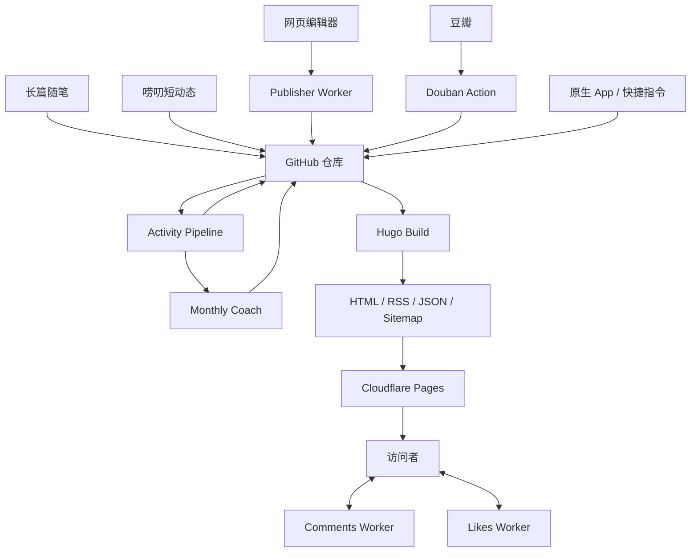

# 架构总览

## 系统定位

惊蛰以 Git 仓库作为内容与公开数据的主要事实来源，以 Hugo 生成静态站点，并通过 GitHub Actions 和可选 Serverless 服务补足同步、写作与互动能力。

Hugo 是发布核心，但完整系统还包括内容采集、数据加工、动态服务和部署四个边界。

## 主要组件

| 组件 | 当前职责 | 事实来源 |
|---|---|---|
| Hugo | 页面、RSS、JSON、Sitemap 和静态资源生成 | `config/`、`content/`、`themes/`、`static/` |
| 惊蛰 v3 | 布局、响应式设计、深浅主题和功能页面 | `themes/jingzhe_v3/` |
| 网页编辑器 | 写随笔、写唠叨、图片上传、草稿和 GitHub 写回 | `newlaodao.html`、`newsuibi.html` |
| 观影同步 | 从豆瓣增量写入 `movie.json` | `sync_movies.py`、`douban.yml` |
| 运动管线 | 数据清洗、隐私路线、趣味标题和月报触发 | `process_activities.py` |
| AI 月报 | 聚合证据、模型调用、校验和状态冻结 | `monthly_coach.py` |
| 动态服务 | 评论、点赞、发布、图片和云草稿 | `workers/` 中四个独立 Cloudflare Worker |
| GitHub Actions | 同步、测试、处理、构建和部署 | `.github/workflows/` |

## 数据流

## Worker-independent 能力与动态增强

### 不依赖 Worker 的能力

以下能力应在没有任何 Worker 的情况下可用：

- 文章与唠叨展示。
- 标签和分类。
- 深浅主题。
- RSS、JSON 和 Sitemap。
- Full Profile 中的观影 JSON 静态展示。
- Full Profile 中的已处理运动 JSON 静态展示。

最小 Core Starter 只包含文章、唠叨、主题、标签和标准静态输出，不复制 Koobai 的观影或运动数据。

### 动态增强

以下能力依赖外部服务：

- 评论与点赞。
- 管理员网页写作。
- 图片上传。
- 云草稿。
- GitHub 内容写回。

动态增强不可成为 Core 构建的强制依赖。服务缺失时功能必须隐藏或降级，而不是导致构建失败。

## 内容事实来源

- 文章与唠叨以 Markdown 为事实来源。
- 观影以 `assets/movie.json` 为事实来源。
- 运动展示以处理后的 `assets/activities.json` 为事实来源。
- AI 月报以 `assets/monthly_insights.json` 为事实来源。
- `public/` 和 `resources/` 是生成结果，不是事实来源。

## 生产环境与通用发行版

当前仓库首先服务 Koobai 的生产站点，同时提供两个明确分离的视图：

- Production：保留 Koobai 当前完整功能、内容、域名和工作流。
- Core Starter：由工具按需生成通用配置和最小合成内容，不依赖 Koobai 私有服务。

`koobai.com` 是唯一在线演示。Starter 不作为仓库内第二套站点维护，而是在临时目录或用户指定的新目录中从同一主题 Core 子集生成；默认 `hugo` 始终使用 Production。

## Worker 服务边界

动态服务按实际数据与权限拆为四个独立部署单元：

1. Publisher：管理员认证、GitHub 写回和 R2 图片上传。
2. Drafts：管理员云草稿与独立 D1。
3. Comments：公开评论、回复通知、管理删除与独立 D1。
4. Likes：公开点赞、访客去重与独立 D1。

高权限 Publisher 不与公开互动接口共享 GitHub/R2 凭据，Comments 也不与 Likes 共享邮箱数据库。完整边界见 [Worker 安全说明](../security/workers.md)。
